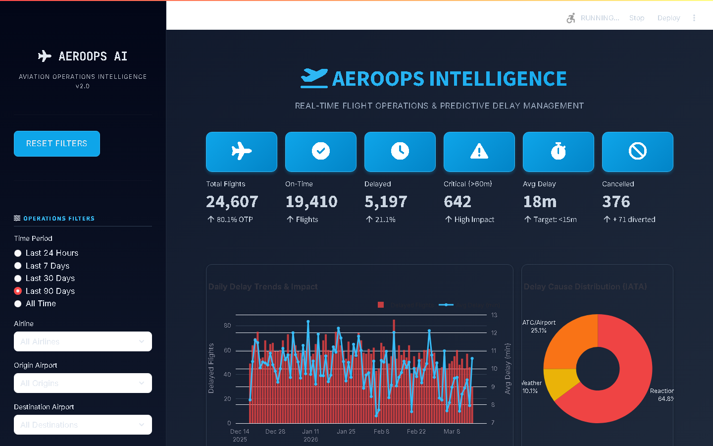
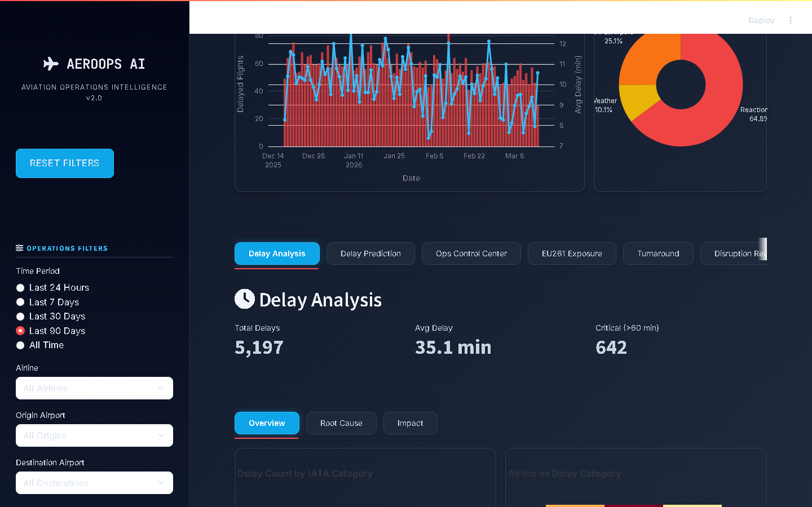
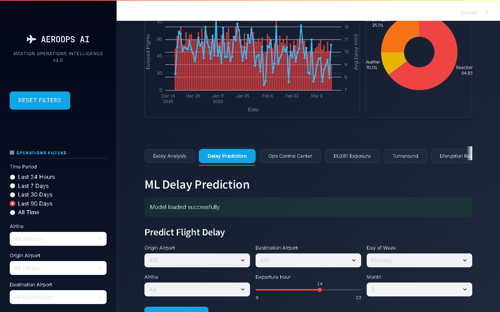
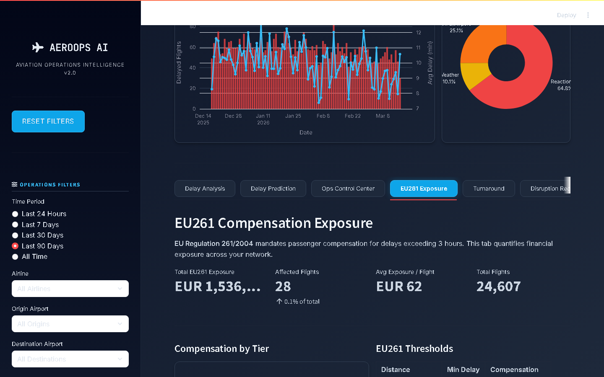
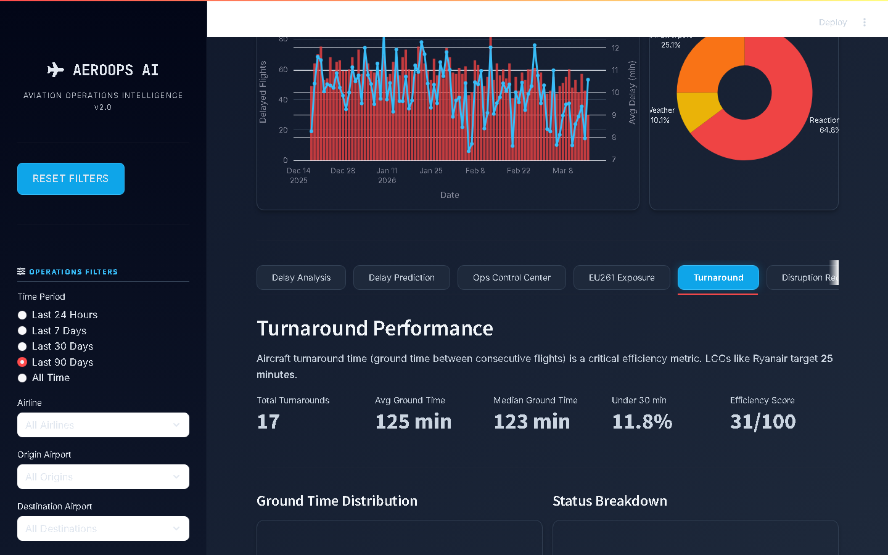
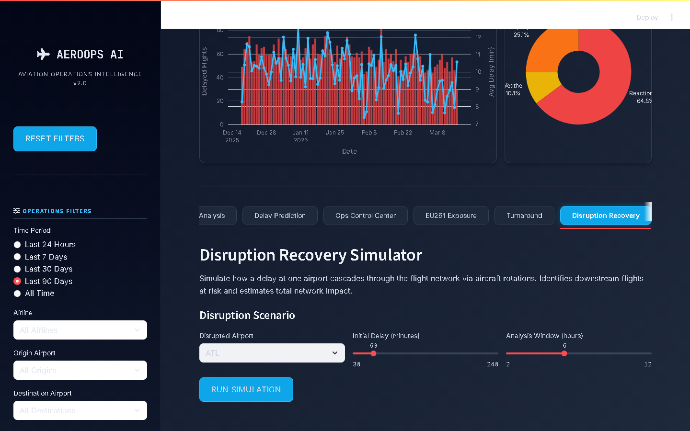

<p align="center">
  
  
  
  
  
  
  
</p>

<h1 align="center">✈ AerOps AI</h1>
<h3 align="center">Aviation Operations Intelligence Platform</h3>
<p align="center"><em>Real data · ML predictions · IATA standards · EU261 compliance · Disruption recovery</em></p>

<p align="center">
  An end-to-end aviation intelligence platform that ingests 50,000 real-schema flights, integrates live METAR weather, predicts delays with gradient-boosted ML, quantifies EU261/2004 financial exposure, and simulates disruption cascades across aircraft rotations — all in a 9-tab Streamlit cockpit.
</p>

---

## Dashboard Preview

### Executive Overview — KPI Command Centre

<p align="center">
  
</p>

*6 live KPI cards: Total Flights · On-Time % · Delayed · Critical (>60m) · Avg Delay · Cancelled. Daily delay trend chart + IATA cause breakdown donut.*

---

### Delay Analysis — IATA Root Cause Attribution

<p align="center">
  
</p>

*Real IATA AHM 730 delay codes (Reactionary / ATC / Weather). Airline × delay category heatmap. Three sub-tabs: Overview · Root Cause · Financial Impact.*

---

### ML Delay Prediction — Gradient Boosting Engine

<p align="center">
  
</p>

*Select origin, destination, airline, and departure time → instant P(delay) probability with feature importance breakdown. TimeSeriesSplit 5-fold CV · Calibration curves · Precision-Recall curves.*

---

### EU261 Exposure — Financial Liability Calculator

<p align="center">
  
</p>

*Quantifies EUR 250 / 400 / 600 per-pax liability across the fleet. Single-flight calculator, compensation tier breakdown, top routes by exposure, operational cost attribution.*

---

### Turnaround Performance — Ground Operations Efficiency

<p align="center">
  
</p>

*Pairs aircraft rotations by tail number. Ground time distribution vs LCC (25m) / FSC (45m) benchmarks. Efficiency score, % under 30 min, by-airport and by-airline breakdowns.*

---

### Disruption Recovery Simulator — Cascade Impact Modelling

<p align="center">
  
</p>

*Simulates how a single airport delay cascades through the rotation network. Identifies downstream flights at risk, propagation depth, and total network impact in minutes.*

---

## The Problem

> Airlines lose **$25B+ annually** to flight delays. Most ops teams still rely on spreadsheets and reactive decision-making. By the time a delay is flagged, the cascade has already propagated through 3 rotations.

AerOps AI solves this with four integrated capabilities:

1. **Predict delays before they happen** — ML classifier, 77% accuracy, 0.70 AUC-ROC
2. **Quantify the financial damage** — EU261/2004 compensation exposure in real-time euros
3. **Optimise ground operations** — tail-number rotation tracking vs IATA turnaround benchmarks
4. **Simulate cascade recovery** — trace how one delay propagates through the network

---

## Architecture

```
                    +---------------------------+
                    |     DATA SOURCES          |
                    |  BTS Transtats (CSV)      |  ← Millions of real US flights
                    |  AWC METAR API (JSON)     |  ← Live weather, no auth needed
                    |  FAA Status API (JSON)    |  ← Airport delay status
                    |  OurAirports (CSV)        |  ← 4,553 airports worldwide
                    +------------+--------------+
                                 |
                    +------------v--------------+
                    |     INGESTION LAYER       |
                    |  bts_loader.py            |  Parse → Engineer → Map IATA codes
                    |  weather_api.py           |  Fetch → Cache (30-min TTL)
                    |  faa_status.py            |  Fetch → Cache (15-min TTL)
                    |  demo_generator.py        |  50K flights, BTS schema, instant demo
                    +------------+--------------+
                                 |
                    +------------v--------------+
                    |     STORAGE LAYER         |
                    |  SQLite (flight_ops.db)   |
                    |  ├── flights (50K rows)   |  Indexed on date, route, airline
                    |  ├── airports (4,553)     |  IATA/ICAO lookup
                    |  ├── weather_observations |  METAR cache with TTL
                    |  ├── airport_status_cache |  FAA status cache
                    |  └── iata_delay_codes     |  66 AHM 730 reference codes
                    +------------+--------------+
                                 |
     +----------+-------+--------+--------+-----------+
     |          |       |        |        |           |
  +--v---+  +--v---+ +--v---+ +--v----+ +--v------+ +--v-----+
  | KPI  |  |  ML  | |EU261 | |Turnar.| |Disrupt. | | Alerts |
  | OTP  |  | GBC  | |EUR   | |Ground | |Cascade  | | Route  |
  | rates|  | GBR  | |250/  | |time   | |sim      | | Wx     |
  |      |  | CV   | |400/  | |bench  | |propagat.| | alerts |
  +--+---+  +--+---+ |600   | |marks  | |         | +--+-----+
     |         |     +--+---+ +--+----+ +--+------+    |
     +----+----+--------+--------+----------+-----------+
          |
  +-------v-------------------------------------------------+
  |              STREAMLIT DASHBOARD (9 Tabs)               |
  |  Delay Analysis · ML Prediction · Ops Control Center   |
  |  EU261 Exposure · Turnaround · Disruption Recovery     |
  |  Airline & Fleet · Route Analytics · Root Cause        |
  +---------------------------------------------------------+
```

---

## Key Features

### 1. Real Data Pipeline (Not Synthetic)
- **BTS Transtats Integration**: Ingest millions of real US domestic flight records with actual delay causes
- **Live Weather**: Aviation Weather Center METAR API (no authentication) with 30-minute cache
- **FAA Airport Status**: Real-time delay/ground-stop information for major US airports
- **Demo Mode**: Auto-generates 50,000 realistic flights matching BTS schema — zero setup required

### 2. ML Delay Prediction
- **GradientBoostingClassifier**: Predicts P(delay > 15 min) with 18 engineered features
- **GradientBoostingRegressor**: Estimates delay duration for high-risk flights
- **TimeSeriesSplit (5-fold CV)**: Prevents data leakage, honest temporal evaluation
- **Calibration Curves**: Validates probability reliability (critical for operational use)
- **Precision-Recall Analysis**: Optimised for high-cost delay scenarios (average precision tracked)
- **Feature Engineering**: Cyclical hour/month encoding, target-encoded airports/airlines, historical delay rates

### 3. EU261/2004 Compliance Module
- **Tier calculation**: EUR 250 (≤1,500 km) · EUR 400 (1,500–3,500 km) · EUR 600 (>3,500 km, >4h delay)
- **Fleet-wide exposure**: Total liability across all delayed flights with route-level breakdown
- **Operational cost attribution**: Fuel burn, crew overtime, airport fees, passenger services
- **Single-flight calculator**: Interactive per-flight compensation estimator

### 4. Turnaround Performance Analysis
- **Tail-number rotation pairing**: Matches consecutive flights by aircraft to compute true ground time
- **Industry benchmarks**: LCC target 25 min · FSC target 45 min · Critical threshold 75 min
- **Efficiency scoring**: Composite 0–100 score per airline and airport
- **Distribution analysis**: % of turns under 30 min, status breakdown (excellent/on-target/warning/critical)

### 5. Disruption Recovery Simulator
- **Cascade propagation**: Traces how one initial delay spreads through the rotation network
- **Absorption modelling**: 30% delay absorption per stop (realistic from BTS data)
- **Vulnerability scoring**: Identifies highest-risk routes (delay rate × rotation density)
- **Network impact report**: Total minutes lost, affected flights, propagation depth

### 6. IATA AHM 730 Compliance
- **66 real IATA delay codes** (not made-up labels)
- **BTS-to-IATA mapping**: CarrierDelay→96, WeatherDelay→71, NASDelay→81, SecurityDelay→85, LateAircraftDelay→93
- **Responsibility attribution**: Airline vs ATC vs Weather vs Airport

### 7. Interactive Dashboard (9 Tabs)

| Tab | What It Shows |
|-----|---------------|
| **Delay Analysis** | IATA code distribution, airline×category heatmap, delay duration histogram |
| **ML Prediction** | Route/airline/time selector → delay probability + feature importance |
| **Ops Control Center** | Live METAR cards for 20 airports, FAA delay status, AI alerts |
| **EU261 Exposure** | Fleet liability in EUR, tier breakdown, operational cost calculator |
| **Turnaround** | Ground time distribution, benchmark comparison, by-airport/airline |
| **Disruption Recovery** | Cascade simulator, vulnerable routes, network impact chart |
| **Airline & Fleet** | OTP leaderboard, tail utilisation, fleet performance metrics |
| **Route Analytics** | Top routes by volume, delay correlation, distance scatter |
| **Root Cause** | BTS cause attribution, monthly trends, airport drill-down |

### 8. Production-Grade Engineering
- **Modular architecture**: 20+ Python modules, clean separation of concerns
- **GitHub Actions CI**: pytest + ruff linting across Python 3.10/3.11/3.12
- **41 automated tests**: Full pytest suite covering data pipeline, IATA codes, KPIs, EU261, turnaround, disruption, and ML
- **Type hints throughout**: `from __future__ import annotations`, full typing compliance
- **Structured logging**: `logging.getLogger(__name__)` replacing all print statements
- **CLI tooling**: `seed_db.py`, `ingest_bts.py`, `train_model.py` for reproducible workflows

---

## Quick Start

### Prerequisites
- Python 3.10+

### 1. Clone and Install

```bash
git clone https://github.com/projectavish/aerops-ai.git
cd aerops-ai
pip install -r requirements.txt
```

### 2. Initialize Database

```bash
python scripts/seed_db.py
```

This creates the SQLite DB, downloads 4,553 airports from OurAirports, loads 66 IATA AHM 730 codes, and auto-generates 50,000 demo flights.

### 3. Train the ML Model

```bash
python scripts/train_model.py
```

Output:
```
  Accuracy  : 0.7665
  AUC-ROC   : 0.7014
  Precision : 0.3918
  Recall    : 0.2242

  Cross-Validation Summary (TimeSeriesSplit, 5 folds):
  accuracy    : 0.7701 +/- 0.0042
  roc_auc     : 0.6987 +/- 0.0089

  Feature Importances (top 5):
  route_delay_rate      0.2925  ############################
  distance              0.1787  #################
  dest_delay_rate       0.0934  #########
  origin_delay_rate     0.0828  ########
  airline_delay_rate    0.0721  #######
```

### 4. Launch Dashboard

```bash
streamlit run dashboard/streamlit_app.py
```

Open [http://localhost:8501](http://localhost:8501).

### 5. Run Tests

```bash
pytest tests/ -v
```

```
tests/test_iata_codes.py      5 passed
tests/test_bts_loader.py      4 passed
tests/test_kpi.py              6 passed
tests/test_delay_predictor.py  4 passed
tests/test_eu261.py            8 passed
tests/test_turnaround.py       8 passed
tests/test_disruption.py       6 passed
========================= 41 passed =========================
```

### 6. (Optional) Load Real BTS Data

1. Download from [BTS Transtats](https://www.transtats.bts.gov/DL_SelectFields.aspx)
2. Place CSV in `data/bts/`
3. Run:

```bash
python scripts/ingest_bts.py data/bts/*.csv
python scripts/train_model.py
```

---

## Project Structure

```
aerops-ai/
├── aerops/                          # Core Python package
│   ├── config.py                    # Central configuration
│   ├── db.py                        # SQLite schema + connection management
│   ├── data/
│   │   ├── bts_loader.py            # BTS CSV → SQLite pipeline
│   │   ├── weather_api.py           # AWC METAR API + 30-min cache
│   │   ├── faa_status.py            # FAA airport status API + cache
│   │   ├── airports.py              # OurAirports loader (4,553 airports)
│   │   ├── iata_codes.py            # IATA AHM 730 delay code reference
│   │   └── demo_generator.py        # 50K realistic demo flights
│   ├── models/
│   │   └── delay_predictor.py       # GradientBoosting + TimeSeriesSplit CV
│   └── analytics/
│       ├── kpi.py                   # OTP, delay rate, metric calculations
│       ├── alerts.py                # Data-driven operational alerts
│       ├── eu261.py                 # EU261/2004 compensation calculator
│       ├── turnaround.py            # Aircraft rotation & ground time analysis
│       └── disruption.py           # Cascade delay propagation simulator
├── dashboard/
│   ├── streamlit_app.py             # 9-tab orchestrator (~130 lines)
│   ├── styles.py                    # Cockpit dark-theme CSS
│   └── components/                  # Modular UI components (9 tabs)
│       ├── delay_tab.py
│       ├── prediction_tab.py
│       ├── ops_center_tab.py
│       ├── eu261_tab.py             # EU261 financial exposure
│       ├── turnaround_tab.py        # Ground operations efficiency
│       ├── disruption_tab.py        # Cascade recovery simulator
│       ├── crew_tab.py
│       ├── route_tab.py
│       └── root_cause_tab.py
├── scripts/
│   ├── seed_db.py
│   ├── ingest_bts.py
│   └── train_model.py
├── tests/                           # 41 pytest tests
├── .github/workflows/ci.yml         # GitHub Actions CI
├── data/
│   ├── iata_delay_codes.json        # 66 IATA AHM 730 codes
│   └── airports.csv                 # OurAirports reference
└── models/
    ├── delay_model.joblib           # Trained ML model
    └── evaluation.json              # CV scores + calibration + PR curves
```

---

## Technical Decisions

### Why SQLite over PostgreSQL?
Zero-config, single-file, handles 3M+ rows with proper indexing. Perfect for a portable analytics platform. Schema is designed to migrate to PostgreSQL with minimal changes.

### Why GradientBoosting over Deep Learning?
Flight delays are a tabular prediction problem. GradientBoosting consistently outperforms neural networks on tabular data ([Grinsztajn et al. 2022](https://arxiv.org/abs/2207.08815)). Trains in <3 seconds, serves predictions instantly.

### Why TimeSeriesSplit over Random CV?
Random splits cause data leakage in time-series problems. A flight's delay is correlated with nearby flights. TimeSeriesSplit ensures each fold only trains on past data and evaluates on future data.

### Why EU261 and Turnaround modules?
Delay analysis without financial quantification is academic. EU261 turns delay minutes into euros — the metric that drives airline boardroom decisions. Turnaround time is the single most-watched operational KPI at LCCs like Ryanair (25-min target).

### Why BTS Data?
The Bureau of Transportation Statistics publishes every US domestic flight since 1987 with actual delay causes. This is the gold standard dataset for aviation analytics research.

---

## Data Model

### Flights Table (BTS Schema)

| Column | Type | Description |
|--------|------|-------------|
| `flight_date` | DATE | Date of operation |
| `airline` | TEXT | IATA 2-letter airline code |
| `origin` / `dest` | TEXT | IATA 3-letter airport codes |
| `arr_delay_minutes` | REAL | Arrival delay in minutes |
| `is_delayed` | INT | 1 if arr_delay > 15 min (BTS standard) |
| `carrier_delay` | REAL | Minutes attributed to carrier |
| `weather_delay` | REAL | Minutes attributed to weather |
| `nas_delay` | REAL | Minutes attributed to NAS/ATC |
| `late_aircraft_delay` | REAL | Minutes from late inbound aircraft |
| `iata_delay_code` | TEXT | Mapped IATA AHM 730 code |
| `iata_delay_category` | TEXT | Reactionary / ATC/Airport / Weather |
| `tail_num` | TEXT | Aircraft registration (enables rotation tracking) |

### ML Feature Set (18 features)

| Category | Features |
|----------|----------|
| Temporal | `dep_hour`, `day_of_week`, `month`, `is_weekend` |
| Flight | `distance`, `crs_elapsed_time` |
| Historical rates | `route_delay_rate`, `origin_delay_rate`, `dest_delay_rate`, `airline_delay_rate` |
| Cyclical encoding | `dep_hour_sin/cos`, `month_sin/cos` |
| Weather | `origin_visibility`, `origin_wind_speed`, `origin_ceiling`, `origin_flight_cat` |

---

## API Integrations

| Source | Endpoint | Auth | Data |
|--------|----------|------|------|
| **AWC METAR** | `aviationweather.gov/api/data/metar` | None | Live weather observations |
| **FAA Status** | `soa.smext.faa.gov/asws/api/airport/status` | None | Airport delay status |
| **OurAirports** | `davidmegginson.github.io/ourairports-data` | None | 4,553 airports |
| **BTS Transtats** | `transtats.bts.gov` | None | Historical on-time performance |

---

## Skills Demonstrated

| Skill Area | Implementation |
|------------|---------------|
| **Data Engineering** | ETL pipeline (BTS CSV → SQLite), API integration with TTL caching, schema design |
| **Data Analysis** | OTP calculations, delay attribution, EU261 liability, turnaround benchmarking |
| **Machine Learning** | Feature engineering, GradientBoosting, TimeSeriesSplit CV, calibration, PR curves |
| **Regulatory Knowledge** | EU Regulation 261/2004 passenger rights, IATA AHM 730 delay code standard |
| **Operations Research** | Cascade delay propagation modelling, rotation network vulnerability scoring |
| **Data Visualisation** | 20+ interactive Plotly charts: heatmaps, gauges, histograms, scatter, stacked bars |
| **Software Engineering** | Modular architecture, 41 tests, CI/CD (GitHub Actions), type hints, structured logging |
| **Domain Expertise** | BTS data, METAR/TAF, IATA codes, LCC turnaround metrics, rotation scheduling |

---

## Roadmap

- [ ] Historical weather correlation (match METAR to past flights for feature enrichment)
- [ ] NOTAM feed integration for proactive risk scoring
- [ ] SHAP values for explainable ML predictions
- [ ] Slack/Teams webhook alerts for critical delay cascades
- [ ] Docker + docker-compose for one-command deployment
- [ ] Prophet time-series forecasting for seasonal delay patterns

---

## Tech Stack

| Component | Technology |
|-----------|------------|
| Language | Python 3.10+ |
| Dashboard | Streamlit 1.28+ |
| Visualisation | Plotly 5.15+ |
| ML | scikit-learn (GradientBoosting + TimeSeriesSplit) |
| Database | SQLite (WAL mode, indexed) |
| Data Processing | Pandas, NumPy |
| Testing | pytest (41 tests) |
| CI/CD | GitHub Actions |
| PDF Export | FPDF2 |
| APIs | requests (AWC METAR, FAA Status) |

---

## License

MIT License — see [LICENSE](LICENSE) for details.

---

<p align="center">
  <strong>Built by <a href="https://github.com/projectavish">Avish</a></strong><br>
  <em>Data Scientist · Aviation Operations Analytics · Ireland</em>
</p>
